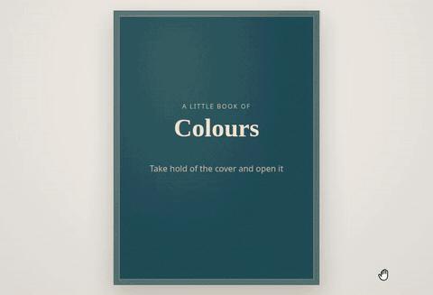

# grabfold

**A page-turn you can grab anywhere.**



Most page-flip libraries fold a page from a corner. grabfold folds it from wherever you take hold of it: grab the edge high or low and the crease starts there; move your hand up or down as you pull and the crease tilts with it, the way paper really does. The page stays bound to the spine however wildly it is dragged, and it lands square on the facing page.

- **Grab anywhere.** The fold is the perpendicular bisector of where you took hold and where your hand is now — real paper geometry, not a corner animation.
- **Hands, not just drags.** A quick **flick** turns a page however little it was pulled; a page's corner **peeks** up when the mouse comes near; a **block of pages** can be taken from the edge of the stack and turned at once.
- **Zero dependencies.** A framework-free core in TypeScript, with thin adapters for **React**, **Vue**, **Svelte** and a **Web Component**.
- **Your pages, untouched.** Each page is painted once and then *moved* through the turn, never cloned — so it keeps its state, its loaded images and its event handlers.
- **Spreads and single pages.** Two pages side by side on wide screens, one page on phones, switching automatically.
- **Hard covers and board pages.** Covers that swing open as rigid boards, with the book starting closed — and sitting in the middle while it is — or any sheet made rigid, for board books and heavy albums.
- **A book with a thickness.** The stacks of pages either side are drawn, and grow and shrink as the book is read.
- **Any binding.** Left, **right to left** (manga, Arabic, Hebrew), or along the **top**, turned upwards like a calendar.
- **A real curl, if you want one.** `grabfold/webgl` bends the page round a cylinder on the GPU, for books whose pages are images — a PDF, a comic, a photo album.
- **Plugins.** Thumbnails, zoom and pan, fullscreen, and the address bar following the page.
- **Jumps.** Going ten pages ahead is one turn, not ten: the page on show lifts and the page you are going to lands, like riffling a block of pages with your thumb.
- **Page-turn sounds, optional.** Three synthesised takes included, timed so the page is *heard* landing when it is *seen* landing — or bring your own.
- **Small.** The core is about 11 kB minified and gzipped. Everything else — sounds, WebGL, plugins, each adapter — is a separate entry point you only pay for if you import it.

**[Try it, and set it up, on the demo site](https://javocsoft.github.io/grabfold/)** — a live configurator that writes the code for you — or browse the [examples](./examples).

```
npm install grabfold
```

## Quick start

```html
<div id="book"></div>
```

```js
import { Grabfold } from "grabfold";

const book = new Grabfold(document.getElementById("book"), {
  sheets: 12,
  pageRatio: 3 / 4,
  render(slot, page) {
    // Paint one page into `slot`. Called once per page.
    if (page.kind === "cover") slot.innerHTML = `<h1>My book</h1>`;
    else slot.innerHTML = `<p>${page.kind} of sheet ${page.sheet}</p>`;
  },
});

book.next(); // turn a page from code
```

The book fills its container's width, and its height follows from `pageRatio`. With `fit: "contain"` it is instead the largest book that fits the container's width *and* height — give the container a height.

## React

```tsx
import { GrabfoldBook } from "grabfold/react";

export function Book() {
  return (
    <GrabfoldBook
      sheets={12}
      pageRatio={3 / 4}
      renderPage={(page) =>
        page.kind === "cover" ? <h1>My book</h1> : <Page sheet={page.sheet} side={page.kind} />
      }
    />
  );
}
```

`renderPage` returns ordinary React: components, state, effects and handlers all work, and a page keeps its state through a turn. It is rendered into its page through a portal.

The component can be **controlled** with `position` and `onPositionChange`, and driven through a ref:

```tsx
const book = useRef<GrabfoldBookHandle>(null);
const [position, setPosition] = useState(-1);

<GrabfoldBook ref={book} position={position} onPositionChange={setPosition} /* … */ />
<button onClick={() => book.current?.next()}>Next</button>
<button onClick={() => setPosition(5)}>Go to the middle</button>
```

`grabfold/react` is marked `"use client"`, so it works in the Next.js App Router.

## Vue

```vue
<script setup>
import { ref } from "vue";
import { GrabfoldBook } from "grabfold/vue";

const position = ref(-1);
</script>

<template>
  <GrabfoldBook :sheets="12" covers="hard" v-model:position="position">
    <template #page="{ page }">
      <MyPage :page="page" />
    </template>
  </GrabfoldBook>
</template>
```

Each page is the `#page` slot, teleported into its place: reactive state and components survive a turn. It emits `turnstart`, `turn`, `change`, `layout` and `update:position`, and exposes `next()`, `prev()`, `turnTo()`, `jumpTo()` and `book` through a template ref.

## Svelte

An action, with no dependency on Svelte itself. Mount a component per page and return its unmount:

```svelte
<script>
  import { mount, unmount } from "svelte";
  import { grabfold } from "grabfold/svelte";
  import Page from "./Page.svelte";
</script>

<div use:grabfold={{
  sheets: 12,
  render(slot, page) {
    const component = mount(Page, { target: slot, props: { page } });
    return () => unmount(component);
  },
}}></div>
```

The book is at `node.grabfold` for `next()`, `prev()` and the rest.

## Web Component

No framework and no script of your own: the children are the pages, in reading order.

```html
<script type="module" src="https://cdn.jsdelivr.net/npm/grabfold/dist/element.js"></script>

<grab-fold covers="hard" label="Recipes" page-ratio="0.75" style="max-width: 800px">
  <div data-cover="front">…</div>          <!-- outside of the front cover -->
  <div data-cover="front-inside">…</div>   <!-- optional -->
  <div>Page 1</div>
  <div>Page 2</div>
  <div>Page 3</div>
  <div data-cover="back-inside">…</div>
  <div data-cover="back">…</div>
</grab-fold>
```

`sheets` is worked out from the children; pages added later are picked up. Attributes: `covers`, `binding`, `layout`, `fit`, `page-ratio`, `position`, `duration`, `thickness`, `shadow`, `gutter`, `lift`, `label`, `spread-query`, and the switches `no-gestures`, `no-peek`, `no-flick`, `no-keyboard`, `no-grab-block`, `no-center`. The element has `next()`, `prev()`, `turnTo()`, `jumpTo()`, `position`, `book`, and `configure({ sound, hard, foldRenderer })` for what cannot be an attribute; its events are `turnstart`, `turn`, `change`, `layout` and `resize`, with the details in `event.detail`. Import `GrabfoldElement` and call `defineGrabfold("my-name")` to use another tag name.

## Sound

Page-turn sounds are optional and live in their own entry points, so the core never carries any audio:

```js
import { Grabfold } from "grabfold";
import { createPageTurnSound } from "grabfold/sound";
import { defaultBoardTurnTakes, defaultPageTurnTakes } from "grabfold/sounds";

const sound = createPageTurnSound({
  takes: defaultPageTurnTakes,
  boardTakes: defaultBoardTurnTakes, // hard covers and board pages sound like card
});
sound.preload(); // decode ahead, so the first turn is heard on time

new Grabfold(element, { sheets: 12, render, sound });
```

In React, pass the same object as the `sound` prop — create it once, with `useState(() => createPageTurnSound(…))`.

What you get:

- **Landing in sync.** A turn eases out, so the page looks landed well before the animation ends. Each take knows the instant its own landing happens and is started partway in so the two coincide: a button's full turn gets the whole sound, a drag let go near the end gets little more than the landing, an instant turn (reduced motion) gets only the landing.
- **Only real turns.** A drag let go early drops back silently.
- **No repetition.** One of several takes per turn, never the same twice running, with a slight pitch variation on top.
- **Direction.** Turning back plays the takes with their stereo mirrored, so the sound travels the way the page does.
- **Paper and board.** Hard covers and board pages have their own takes — a lower swing, the knock of the hinge, a dull thock on landing — when you pass `boardTakes`.
- **Safari-proof.** Decoded ahead on an offline context, and woken by the first touch, since Safari only lets audio start inside a gesture.

### Your own sounds

```js
const sound = createPageTurnSound({
  takes: [
    { src: "/sounds/page-a.mp3", landsAt: 0.42 }, // seconds into the file where the page lands
    { src: "/sounds/page-b.mp3", landsAt: 0.40 },
  ],
  backTakes: [{ src: "/sounds/page-back.mp3", landsAt: 0.41 }], // optional
  volume: 0.6,
  pitchVariation: 0.05,
});

sound.volume = 0.3;   // change at any time
sound.muted = true;
```

| Option | Default | |
| --- | --- | --- |
| `takes` | — | `{ src, landsAt? }[]`. `src` is a URL, a `data:` URI, an `ArrayBuffer` or an `AudioBuffer`. Without `landsAt` a take plays from its start. **Required.** |
| `backTakes` | `takes`, mirrored | Sounds for turning paper back. |
| `boardTakes` | `takes` | Sounds for rigid leaves: hard covers and board pages. Mirrored going back. |
| `mirrorBack` | `true` | Mirror `takes` left to right when turning back. |
| `volume` | `0.7` | 0 to 1. Also a settable property. |
| `muted` | `false` | Also a settable property. |
| `sync` | `true` | Time each take so its landing meets the page's. |
| `pitchVariation` | `0.03` | Random pitch nudge per play, ±3%; `0` for none. |
| `sources` | all | Which turns are heard: `"drag"`, `"api"`, `"keyboard"`. |
| `context` | its own | An `AudioContext` to share with the rest of your page's audio. |

The player has `preload()`, `volume`, `muted` and `dispose()`. And the book's `sound` option takes **anything with a `play(event)` method**, so you can route turns into your own audio engine instead; `event.duration` and `arrivalTime()` give you the timing.

### The default sounds

`grabfold/sounds` embeds the default takes — three of paper, two of board — as `data:` URIs (about 125 kB, 89 kB gzipped), so they work in any bundler, and with none, without configuring assets. Import it lazily if you would rather it did not weigh on first load:

```js
const { defaultPageTurnTakes, defaultBoardTurnTakes } = await import("grabfold/sounds");
```

The MP3 files themselves are in the package too — `grabfold/sounds/page-turn-1.mp3` to `-3.mp3` and `board-turn-1.mp3` to `-2.mp3` — with their landing times in [`sounds/takes.json`](./sounds/takes.json), for serving them yourself.

They were synthesised from scratch — noise and sine waves, no samples — by [`scripts/sounds/generate.py`](./scripts/sounds/generate.py), and are released under the same MIT licence as the code. To make your own variations, edit the script and follow the instructions at its top.

## Gestures

- **Drag** a page from anywhere on it. Past `commitAt` (40% of the way) it turns; before, it drops back.
- **Flick** it: let go while the hand is moving fast and the direction decides, however short the pull — the way a page is really flicked over. A flicked page also finishes at the speed it was sent off with. `flick: false` goes by distance only.
- **Peek**: with a mouse, a page's corner lifts a little as the pointer nears its free edge, following the pointer up and down — an invitation to take hold of it. Press and pull, and the peek becomes the drag. Over a link, button or input the page lies down so it can be used; add `data-grabfold-no-peek` to anything else that should do the same. `peek: false` turns it off.
- **Grab a block**: on a spread, take hold of the edge of a stack of pages — just outside the page — and several are turned at once. Near the page a couple, further out more, up to the whole stack; a label says how many as the pointer hovers. `grabBlock: false` turns it off.
- **Keys**: while the book has focus, the arrows go the way the pages do (see [Bindings](#bindings)), with Page Up/Down, Home and End.

`gestures: false` makes the book turn from code and keys only.

## Bindings

```js
new Grabfold(el, { binding: "right", /* … */ });
```

- **`"left"`** (default) — a western book.
- **`"right"`** — bound on the right and read right to left: manga, Arabic, Hebrew. Pages turn from left to right, the first page is on the left of the first spread, ← turns forward. Your pages' content is *not* mirrored; only the book is.
- **`"top"`** — bound along the top and turned upwards: wall and desk calendars, notepads, top-bound reports. The two pages of a spread are one above the other; ↓ turns forward. `pageRatio` is still each page's width over its height as seen.

## Size, thickness and a closed book

- **`fit`**: `"width"` (default) fills the container's width; `"contain"` is the largest book that fits the container, which must have a height — as it does in fullscreen.
- **`thickness`**: the most the stacks of pages either side are drawn, in pixels (default `10`, `0` for none). A hundred sheets or more is full thickness; fewer are thinner. The left stack grows and the right one shrinks as the book is read.
- **`center`**: a spread showing only one page — a closed book with hard covers, or the first page of a book without covers — slides over to sit in the middle, and slides back as it opens (default `true`).

## How a book is modelled

A book is a stack of **sheets**. Each sheet has a **front**, read on the right-hand side, and a **back**, which is what lands on the left once the sheet is turned — exactly as paper does. So `render` is asked for pages like these:

```ts
type PageRef =
  | { kind: "front"; sheet: number }
  | { kind: "back"; sheet: number }
  | { kind: "cover"; side: "front" | "back"; face: "inside" | "outside" };
```

### Covers

`covers` chooses what the book has at either end:

- **`"inside"`** (default) — the covers' inner faces, glued down: the inside front cover on the left before the first sheet is turned, the inside back cover on the right after the last.
- **`"hard"`** — real covers: boards that turn **rigidly**, swinging round the spine instead of folding. The book starts **closed**, showing the outside of the front cover, and closes again at the back. Each cover has both faces, `outside` and `inside`.
- **`"none"`** — no covers: the book starts on the first sheet's front.

Any sheet can be rigid too, with `hard: (sheet) => boolean` — for a board book, `hard: () => true`. A rigid leaf always turns on its own: a jump across one is split into a turn on either side of it, so going from a closed book to page 10 opens the cover, then riffles the pages.

### Position

Where the book is open is its **position**: the index of the sheet whose back is on the left, so `-1` when only the front cover has been turned.

| Position | Spread shows | Single page shows |
| --- | --- | --- |
| `-2` | *hard:* the closed book — outside front cover | the front cover (*hard:* outside, *inside:* inside) |
| `-1` | inside front cover · front of sheet 0 | front of sheet 0 |
| `n` | back of sheet `n` · front of sheet `n + 1` | front of sheet `n + 1` |
| `sheets − 1` | back of the last sheet · inside back cover | inside back cover |
| `sheets` | *hard:* the closed book — outside back cover | *hard:* outside back cover |

Positions a book does not have are simply clamped: without hard covers a spread starts at `-1`, and on a phone with inside covers at `-2`. A spread reads a phone's `-2` as its own start, so rotating a phone never loses the reader's place.

> **Single pages show fronts only.** On a single page, turning lifts the page on show away and reveals the next sheet's front; the backs pass by on the fold. That suits albums, catalogues and anything whose backs are decorative. For a book with text on both sides of every sheet, prefer the spread layout, or make each sheet a single page. Showing both sides in single-page mode is on the roadmap.

## Options

| Option | Type | Default | |
| --- | --- | --- | --- |
| `sheets` | `number` | — | How many sheets the book has. **Required.** |
| `render` | `(slot, page) => void \| (() => void)` | — | Paints a page. See below. **Required** (core only). |
| `covers` | `"inside" \| "hard" \| "none"` | `"inside"` | What the book has at either end. See [Covers](#covers). |
| `hard` | `(sheet) => boolean` | none | Which sheets are rigid. |
| `binding` | `"left" \| "right" \| "top"` | `"left"` | Where the book is bound. See [Bindings](#bindings). |
| `layout` | `"auto" \| "spread" \| "single"` | `"auto"` | `"auto"` follows `spreadQuery`. |
| `spreadQuery` | `string` | `"(min-width: 640px)"` | When to show a spread in `"auto"` layout. |
| `pageRatio` | `number` | `3 / 4` | One page's width divided by its height, as seen. |
| `fit` | `"width" \| "contain"` | `"width"` | Fill the width, or fit inside the container. |
| `thickness` | `number` | `10` | Most the stacks of pages are drawn thick, in px; `0` for none. |
| `center` | `boolean` | `true` | Slide a closed book to the middle of a spread. |
| `position` | `number` | start | Where to open. |
| `duration` | `number` | `680` | A full turn's running time, in ms. |
| `commitAt` | `number` | `0.4` | Past this share of the way over, letting go finishes the turn. |
| `dragThreshold` | `number` | `10` | Sideways pixels before a press becomes a drag. |
| `gestures` | `boolean` | `true` | Pages can be turned by hand. |
| `flick` | `boolean` | `true` | A quick flick turns the page however short the pull. |
| `peek` | `boolean` | `true` | A page's corner lifts as the mouse nears it. |
| `grabBlock` | `boolean` | `true` | A block of pages can be taken from the edge of a stack. |
| `reducedMotion` | `"auto" \| boolean` | `"auto"` | Turn instantly. `"auto"` follows `prefers-reduced-motion`. |
| `keyboard` | `boolean` | `true` | ← → PageUp PageDown Home End turn pages while the book has focus. |
| `label` | `string` | `"Book"` | The book's accessible name. |
| `shadow` | `number` | `0.4` | Darkest the crease's shading gets, 0–1. |
| `gutter` | `number` | `0.3` | Darkness of the gutter at the spine, 0–1; `0` for none. |
| `lift` | `number` | `45` | How far a turning page lightens towards `--grabfold-lift`, in %. |
| `sound` | `TurnSound` | none | Sound for each turn. See [Sound](#sound). |
| `foldRenderer` | `(doc, shading) => SheetRenderer` | DOM | What draws a soft leaf mid-turn. See [WebGL](#a-real-curl-grabfoldwebgl). |
| `onTurnStart` | `(event) => void` | | A turn has been committed. |
| `onTurn` | `(event) => void` | | A turn has landed. |
| `onLayoutChange` | `(layout) => void` | | Switched between spread and single. |

In React, every option is a prop, `render` becomes `renderPage(page)`, and there are `position`, `defaultPosition`, `onPositionChange`, `className` and `style`.

### `render(slot, page)`

Paint `page` into `slot`, an empty element the size of a page. Each page is painted **once**: during a turn its element is moved onto the turning sheet and then onto the facing side, never repainted or copied. A few pages that go out of sight are kept, painted, so turning back finds them as they were.

If you return a function, grabfold calls it when it lets a page go (after it has been out of sight for a while, or on `destroy()`). If you return nothing, the element is simply dropped.

## API

```ts
book.position;       // where the book is open
book.layout;         // "spread" | "single"
book.binding;        // "left" | "right" | "top"
book.view;           // { left: PageRef | null, right: PageRef | null }
book.viewAt(5);      // what position 5 would show
book.bounds;         // { first, last } positions in this layout
book.dimensions;     // the laid-out size: cellWidth, cellHeight, displayWidth…
book.element;        // the book's outer element, for sizing, zoom or fullscreen
book.isTurning;
book.canNext(); book.canPrev();

await book.next();   // resolves true once landed, false if it could not turn
await book.prev();
await book.turnTo(7); // animated; several pages away is a single turn
book.jumpTo(3);      // instant, no turn events
book.cancelDrag();   // drop a page being dragged, for anything taking the pointer over
book.refresh();      // repaint every page, after their content changed
book.setOptions({ sheets: 20 });
book.destroy();
```

### Events

```js
const off = book.on("turn", (event) => console.log("now at", event.to));
off(); // stop listening
```

| Event | Payload | |
| --- | --- | --- |
| `turnstart` | `TurnEvent` | A turn has been committed. Same as `onTurnStart`. |
| `turn` | `TurnEvent` | A turn has landed. Same as `onTurn`. |
| `change` | `{ position, view }` | The book is open somewhere else: a turn landed, or it was jumped or reshaped. |
| `layout` | `"spread" \| "single"` | Same as `onLayoutChange`. |
| `resize` | `Size` | The book was laid out at a new size. |

The turn events receive:

```ts
interface TurnEvent {
  direction: "next" | "prev";
  from: number;      // position before
  to: number;        // position after
  duration: number;  // ms the turn has left to run (0 when instant)
  jump: boolean;     // more than one step
  hard: boolean;     // a rigid leaf: a hard cover or a board page
  source: "drag" | "api" | "keyboard";
}
```

`onTurnStart` fires when a turn is committed: at once from code, and on release for a drag that goes through. A drag let go early drops back silently.

### Timing anything else to the page landing

A turn is eased out, so the page *looks* landed well before the animation ends. `arrivalTime(duration)` says when, for timing your own effects to it:

```js
import { arrivalTime } from "grabfold";

new Grabfold(el, {
  // …
  onTurnStart({ duration }) {
    setTimeout(sparkle, arrivalTime(duration));
  },
});
```

## A real curl: `grabfold/webgl`

The default renderer folds a page flat along its crease and paints the bend on with shading, which works for any HTML. `grabfold/webgl` bends it: the leaf is a mesh wrapped round a cylinder lying along the same crease, lit, and drawn on the GPU. It is drawn from **an image of each page**, so it suits books whose pages are images anyway:

```js
import { Grabfold } from "grabfold";
import { webglFold } from "grabfold/webgl";

new Grabfold(el, {
  sheets,
  render: (slot, page) => slot.append(canvasFor(page)),       // the page itself
  foldRenderer: webglFold({ texture: (page) => canvasFor(page) }), // its image
});
```

`texture(page)` returns a canvas, an ``, an `ImageBitmap` or a video frame — or a promise of one; until it resolves the leaf is blank paper. The same canvas can be the page and its texture. The curl lands exactly where the flat fold would, so the leaf comes down square and hands over to the page seamlessly; rigid leaves still swing as boards, and the page elements still move through the turn as always, so nothing else changes. Where WebGL is unavailable it falls back to the DOM fold. Options: `radius` (tightness of the curl, default `0.14` of a page width), `segments` (mesh resolution, `48`), `maxPixelRatio` (`2`), `cache` (images kept on the GPU, `12`). `supportsWebGL()` tells you whether it will be used.

The [PDF example](./examples/pdf) reads a PDF with pdf.js and turns it this way. `foldRenderer: null` goes back to the DOM fold.

Anything implementing `SheetRenderer` can be a `foldRenderer`; `foldGeometry` gives you the crease.

## Plugins

`grabfold/plugins` has the extras a reader expects. Each takes a book, uses only its public API, and returns something with `destroy()`:

```js
import { thumbnails, zoom, fullscreen, hashSync } from "grabfold/plugins";

thumbnails(book, document.querySelector("#strip"), {
  height: 72,
  render(slot, page) { slot.append(smallImageOf(page)); }, // pages cannot be shown twice
});
const magnifier = zoom(book, { max: 3 });   // ctrl + wheel, pinch, double-click; Esc zooms out
const screen = fullscreen(book);            // screen.toggle(), .enter(), .exit(), .active
hashSync(book);                             // #position=3 in the address bar, both ways
```

- **thumbnails** — a scrolling strip with one thumbnail per opening, the current one marked and kept in view; choosing one turns the book there. Thumbnails are painted lazily as they scroll into view.
- **zoom** — about the pointer, up to `max`; while zoomed in, dragging pans instead of turning. `zoomTo(scale, x?, y?)`, `reset()`, `scale`.
- **fullscreen** — the book alone on the screen, laid out with `fit: "contain"` while it is there. The backdrop is `--grabfold-backdrop`.
- **hashSync** — keeps the address bar on the page open, so a link opens the book there and a reload keeps the reader's place. `format`/`parse` for your own scheme, `history: true` for a history entry per turn.

## Styling

grabfold draws the pages, the fold and the shading. The colours are CSS custom properties:

```css
#book {
  --grabfold-paper: #fbf8f1; /* the pages, and the back of a turning page */
  --grabfold-lift: #ffffff;  /* what a turning page lightens towards */
}
```

```css
#book {
  --grabfold-board: #1f4f5a;    /* behind a rigid leaf's faces while it turns */
  --grabfold-edge: #f3eee2;     /* the edges of the pages in the stacks */
  --grabfold-backdrop: #1f1d1a; /* around the book in fullscreen */
}
```

Useful class names: `.grabfold-frame` (the outer element, sized to the container), `.grabfold` (the book, with `data-layout`, `data-binding` and, while moving, `data-turning` and `data-dragging`), `.grabfold-stack` (a stack of page edges, with `data-side`), `.grabfold-block-label` (the "+12" shown when grabbing a block), `.grabfold-page` (each side, with `data-side`; a side with no page — the empty half of a closed book — is hidden), `.grabfold-content` (a page's own element, with `data-page`), `.grabfold-sheet` (the turning leaf; `.grabfold-board` when it is rigid).

grabfold adds one small `<style>` element with a few zero-specificity rules (cursor and focus), and uses inline styles. Under a strict Content Security Policy that disallows inline styles, allow them for the book.

## Accessibility

- The book is a focusable region (`role="region"`, `aria-roledescription="book"`, named by `label`), turned with the arrow keys, Page Up/Down, Home and End.
- The turning sheet is `aria-hidden`; only the pages at rest are exposed.
- `prefers-reduced-motion` turns pages instantly unless you say otherwise.
- Announcing the new page is left to you, since only you know what it should say: update a live region from `onTurn`.

## Advanced: the fold on its own

The geometry is exported as pure functions, for drawing a fold your own way — on a canvas, in WebGL:

```ts
import { foldGeometry } from "grabfold";

const fold = foldGeometry({ spine: "left", width, height, progress, grabY, lift });
// fold.leaf, fold.uncovered, fold.flap: polygons
// fold.place: where to put the folded face (translate + rotate)
// fold.roll, fold.cast: where the shading bands go
```

## Browser support

grabfold uses Pointer Events, `clip-path: polygon()`, `color-mix()`, `overflow: clip`, `ResizeObserver` and, for rigid leaves, CSS 3D transforms — so Chrome/Edge 111+, Firefox 113+ and Safari 16.2+. `grabfold/webgl` needs WebGL 1 or 2 and falls back without it.

**What is tested:** an end-to-end suite in Playwright turns real pages in the examples — drags, flicks, peeks, blocks, bindings, every adapter, the PDF reader — in **Chromium and Firefox**, and in **WebKit** on CI, with screenshots of mid-turn frames compared in Chromium. By hand: Chrome on desktop and with mobile touch emulation. Real iOS and Android devices have not been tried yet; reports and fixes are very welcome.

## Limitations and roadmap

- Single-page layout shows sheet fronts only (see above).
- The WebGL curl draws from page images, so live HTML pages turn with the DOM fold; the two can't be mixed within one turn.
- Grabbing a block of pages needs room beside the book, so it is only offered on a spread.
- Accessibility is on the roadmap: announcing pages, and a turn that can be driven entirely by assistive technology.

## Origin and credits

grabfold started life as the page-turn of the card album in [Daily Ocarina](https://daily-ocarina.crucetaplay.com), a daily puzzle game, where the pages needed to turn however a player took hold of them.

The approach — a flat sheet clipped and rotated, with the bend carried entirely by shading — was inspired by [StPageFlip](https://github.com/Nodlik/StPageFlip) by Nodlik (MIT). grabfold's geometry, gestures and rendering are its own; the idea of doing it in 2D was theirs, and credit is due.

## Development

```
npm install
npm run check        # typecheck, unit tests, build
npm run demo         # build the library and the examples, then open http://localhost:5173/examples/
npm run e2e          # the Playwright suite (npx playwright install first)
npm run site         # the demo site in _site/, as GitHub Pages publishes it
npm run gif          # re-record docs/grabfold.gif (needs ffmpeg)
npm run sounds       # re-embed sounds/*.mp3 into src/sounds.ts
```

The unit tests run on Node's built-in test runner, straight from the TypeScript sources through Node's own type stripping (Node 22.18+ or 23.6+). They cover the pure parts — the fold, the curl, the book model, flicks, peeks, stacks, bindings and the sound timing.

The end-to-end tests run Chromium and Firefox locally; WebKit runs on CI, or locally with `GRABFOLD_WEBKIT=1` once its system libraries are installed (`npx playwright install-deps webkit`). Screenshots live in `e2e/__screenshots__`; a missing one is written on the first run.

The demo site is published by `.github/workflows/pages.yml`: in the repository's settings, set Pages to deploy from GitHub Actions.

## License

[MIT](./LICENSE) © JavocSoft — use it, change it, fork it and ship it, in anything, free of charge.

### A credit is appreciated

Not required, but if grabfold turns the pages of something you make — especially something you sell — a mention in your credits, your "about" page or your site's footer helps it reach the next person who needs it:

> Page turns by [grabfold](https://github.com/JavocSoft/grabfold)

A star on [GitHub](https://github.com/JavocSoft/grabfold), or a line telling us where it is being used, is just as welcome.
